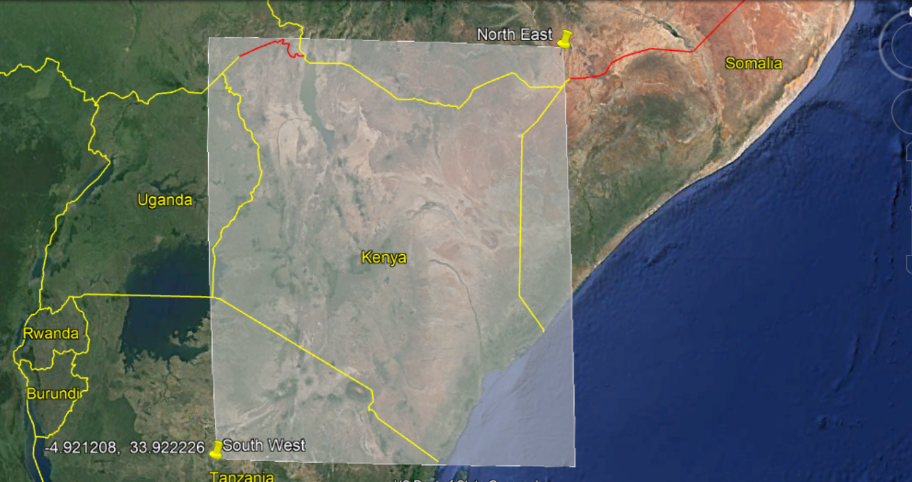

# ANGA UTM


[](https://app.netlify.com/sites/competent-wescoff-227917/deploys)

> `This is a LAANC (Low Altitude Authorization and Notification Capability) to UTM (UAV Traffic Management) implemetation for drones / UAS / RPAS. It includes drone Registrations, drone flight plans, drone Geofences and drone approvals`


## Overview

> The software is a LAANC implementation. LAANC is Low Altitude Airspace Authorization and Notifications.
>
> 1. Registration
> 2. Flight Plans submission and Authorization.
> 3. Geofences.
> 4. NOTAM and Notifications

## [Full Documentation ↗️🔗](https://competent-wescoff-227917.netlify.com/)

- [Registration](docs/registration.md)


    - [RPAS/UAS Registration](docs/registration.md#rpas-registration)

    - [Payload Registration](docs/registration.md#payload-registration)

    - [Personnel Registration and Profiles](docs/registration.md#personnel-registration-and-profiles)

    - [Organisation Registration](docs/registration.md#organization-registration)

- [Flight Plans](docs/flight-plans.md)


    - [Geofences](docs/flight-plans.md#geofences)

    - [Flight Areas](docs/flight-plans.md#flight-areas)

    - [NOTAMS](docs/flight-plans.md#notams)

    - [RPAS/UAS Selection](docs/flight-plans.md#rpasuas-selection)

- [Messages and Notifications](docs/messages.md)
- [Civil Aviation Approvals](docs/approvals.md)


    - [Approved Flights](docs/approvals.md#requested-flight-approvals-list)

    - [Pending Approvals](docs/approvals.md#requested-flight-details-page)

    - [Approval Section](docs/approvals.md#rapproval-section)

- [Company Management](docs/company.md)


    - [Postholds](docs/company.md#my-postholds)

    - [Flight Logs](docs/company.md#flight-logs)

## Install Instructions 📥

> The new version of the app works best on linux/MacOS environment. For windows installation, kindly check out the official [Django documentation](https://docs.djangoproject.com/en/3.0/ref/contrib/gis/install/#windows) to install GEOS and GDAL libraries and how to configure them. Alternatively, I can recommend you install [Windows Subsystem for Linux (WSL)](https://docs.microsoft.com/en-us/windows/wsl/install-win10) and use the Ubuntu environment inorder to install the dependacies using the steps below

#### Steps

- `Clone the repo`

```bash
git clone https://github.com/geoffreynyaga/ANGA-UTM.git
```

- `create a python virtualenvironment`

```bash
virtualenv venv
```

- `activate the virtualenvironment`

```bash
source venv/bin/activate
```

- `install python packages`

```bash
pip install -r requirements.txt
```

- `install geojango Geospatial Libraries packages`

```bash
sudo apt-get install binutils libproj-dev gdal-bin
```

- `create a postgres database on called "anga_utm" or equivalently give it a custom name and make sure to change the value in the local.py settings file`

- `run migrations`

```bash
python manage.py migrate
```

- `create superuser`

```bash
  python manage.py createsuperuser
```

- `log in to the admin and under "Authentication and Authorization" create a group called CAA and give the group the relevant permissions that Civil Aviation requires e.g. changing reserved airspaces, adding/changing NOTAMs`

- `One more thing... By default, the application is country-specific, and the default country is Kenya, but this constraint can be removed.`

`If you log in the app, the map will always be bound to Kenyan borders. To cahnge this to another country, draw a box on Google maps/earth that covers the entire country of your choice. Then get the North East lattitude/longitude as well as South Western lat/long of the bounding box`

`An example for Kenya can be seen in the image below`



- Finally, take those values and insert them in `applications/templates/applications/airspaces.html` in this line

```javascript
bounds = new L.LatLngBounds(new L.LatLng(<northEastLatitude>,<northEastLongitude>), new L.LatLng(<southWestlattitude>,  <southWestLongitude>));
```
