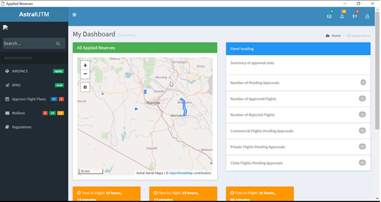
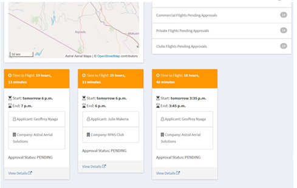
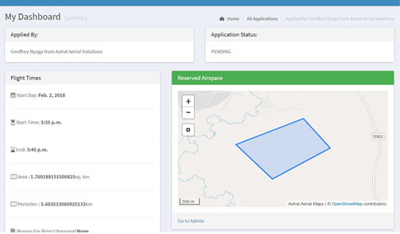
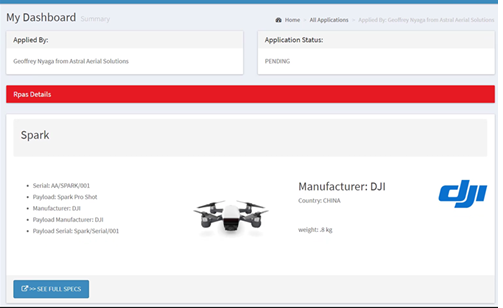
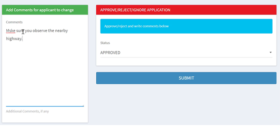

# Approvals

The platform offers a special feature for CAA staff to see all requested flights, approve/reject them, advise/comment on the flight plans and see all drone flight plans and also edit the flight plans.

In the above image, we can be able to see a summary of the following statistics:

- Number of pending approvals
- Number of approved flights
- Number of rejected flights
- ROC/Commercial flights
- Recreation flights number etc
  On the left of the image, there is also a map showing all the pending flights.

## Requested Flight Approvals List

On the same flight summary page, there is a list containing the details of all requested flights. The basic information shown include:

- Time to start of flight ( this can help prioritize flights that are about to happen)
- The exact time of mission start
- The exact time of mission end
- Name of applicant
- Name of ROC/RTO/Club where he/she comes from
- Approval status of the flight

There is also a link where the CAA staff can click to see the full details of each requested flight.

## Requested flight details page.

This is where the authorized CAA staff member will be able to see ALL information pertaining the flight. The exact details are broken down below:

- Airspace details and Mission time
  In the part of the mission details, the CAA authorized staff will be able to clearly see all details about the location of the flight.

  

- ## Mission RPAS

  In this section of the page, the authorized CAA staff can be able to see the specific RPAS that is being used. The following summary can be seen with the OPTION to see full details of the RPAS:

  > 1. RPAS Serial
  > 2. RPAS payload
  > 3. Manufacturer of RPAS
  > 4. Picture of actual RPAS
  > 5. RPAS weight

  If you click on the SEE FULL SPECS button, then you can view the full details of the RPAS which includes information of the payload, payload models, manufacturers, payload serials.

  

- ## Approval Section

  This is where the CAA staff will APPROVE or REJECT the flight plan.
  However, there is an option where he/she can comment on the flight plan on recommended changes on which the applicant will be notified of the comments. The applicant then can make the requested changes and the flight can be approved

  
