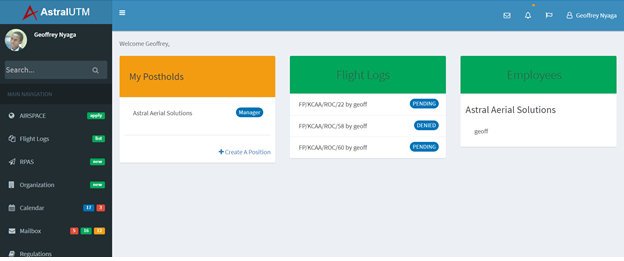

## Company Management

This section is an interface for companies/RTOs/Clubs to manage their respective organisations.
An accountable manager, for example, can be able to view all the employees, their ratings, all RPAS in the company, their maintenance status etc.

## My Postholds

In this category, the user can be able to see his designated postholds in the company or in multiple companies (i.e. in the case where a pilot does flying for multiple companies or for individuals who own multiple companies.)

## Flight Logs.

This portion shows all flight logs associated with the company. The accountable manager and any other selected management personnel can view all company logs but pilots can only see their logs.
