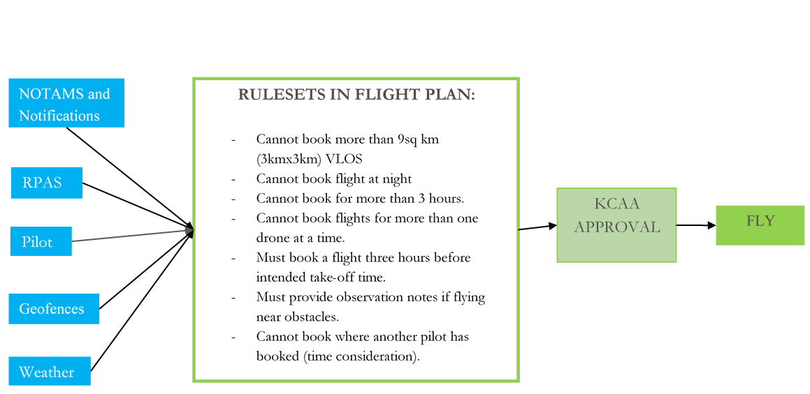
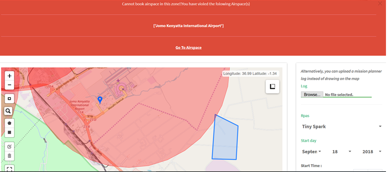
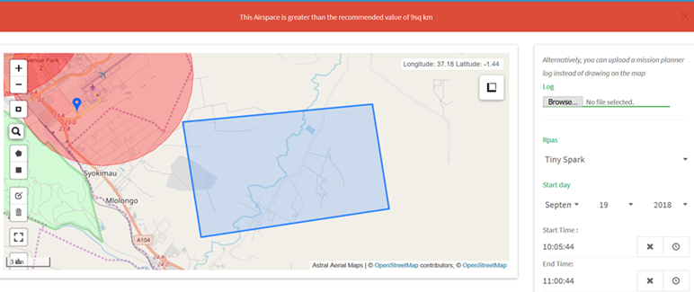
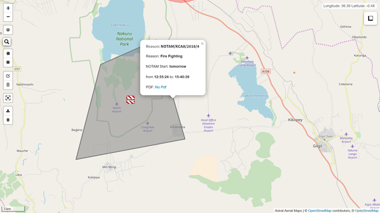
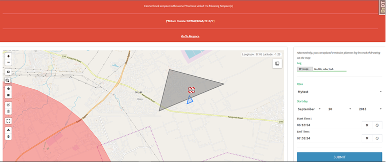
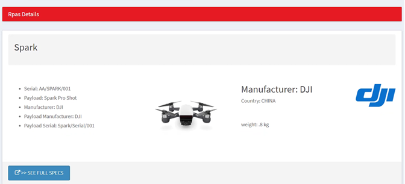

# Flight Plans

`The platform offers basic and advanced functionality for flight planning and approvals.`

## Geofences

Here, no flight plans are accepted if the reserved airspace inside any marked geofence location.

## Flight Areas

The flight plans do not allow by default to book more than the recommended line of sight area (3km x 3km). Can be customized to allow BVLOS Rated pilots to book further flight distances.

## NOTAMS

These are areas that have been temporarily been placed under a NOTAM and can be due to a variety of reasons e.g fireworks, firefighting, airshows, stadium events, marathons, search and rescue, highway accident etc.

A pdf of the NOTAM is also available for download if provided. The NOTAM notifies pilots on what it is about, when it starts end ends and a pdf on the same.

NOTE: NOTAMS can ONLY be published by selected CAA staff who has special authentication to do so.

## RPAS/UAS SELECTION

Here, a pilot is only restricted to selecting an approved and registered RPAS for the mission.
The RPAS list is both for the RPAS the pilot owns and also the RPAS that the organization that he works for owns. Specific restrictions can also be made upon request e.g:

- Multirotor rated pilots can only fly specific rated aircrafts
- A certain class of RPAS can only be flown by BVLOS rated pilots for example.

