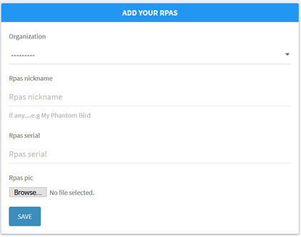
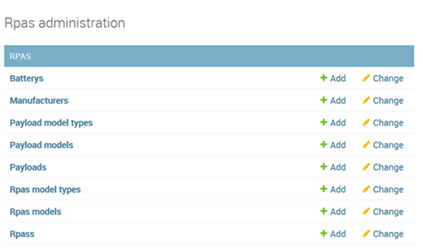
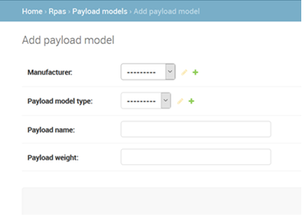
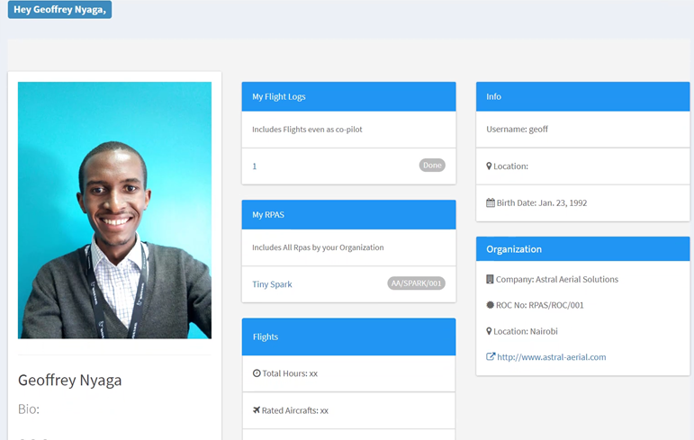
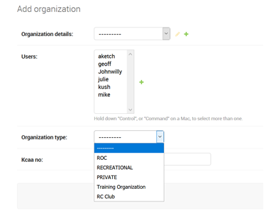
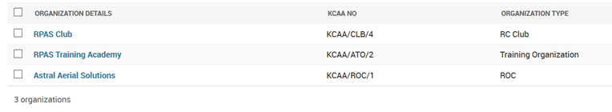

# Registration

`This section covers both RPAS, organisation and personnel registration.`

### `STEP 1`

## RPAS / UAS REGISTRATION

The user first enters the general useful information on the RPAS i.e the Serial number, its actual picture (that helps identify it for example in case of incident) and RPAS nickname to help the pilot recognize the RPAS amongst his/her own fleet of similar RPAS.
The user is also requested to selt an organization that also helps to tie the RPAS to a specific ROC, RTO, private, Club or recreational categories.

### `Step 2: More Detailed Information`

> The various components that make up an RPAS are also individually registered and associated with a specific RPAS.
>
> For example:
>
> - Battery serial and manufactuer for enterprise drones that require frequent battery changes. This also helps in subsequent battery logs in flight plans.
> - Manufacturer database for RPAS, payloads and other accessories.
> - Payload model types e.g RGB, Infra-red, multispectral for agriculture, EO etc. This classification can help in regulating where certain drones cant fly.
> - Etc.

## Payload registration

For example, when registering a payload for a certain RPAS, the user I prompted to provide information about the Manufacturer, the payload model type(e.g Infra-red), payload serial, payload weight etc.

## Personnel Registration and Profiles

The personnel profile (available to be seen by all users) provides a list of the following:

- Pilot details
- Pilot contacts
- The company they work for
  However, CAA can be able to also see the following additional information:
- Flight history
- Rated aircrafts
- Hours done
- RPAS owned by the pilot
- Home address.

## Organization Registration

NB: This registration can only be done by an authorized staff from CAA.

As per regulation, the following options are available in organization registration:

- ROC
- PRIVATE
- RTO
- CLUB
- RECREATIONAL
  RPAS Training Organisations have also been separated from ROCs due to the following factors:
- Most pilots registered here will be student pilots with no license
- Training school will be under “green zones” of flying where authorizations might be given automatically if flying inside the school premises.
- In case of other pilots flying nearby or in same airspace, they will know there are student flights near them for safety awareness.

The green zones concept will also be applied to RC Club premises.

Recreational is the basic ‘organization level’ for recreational users.

